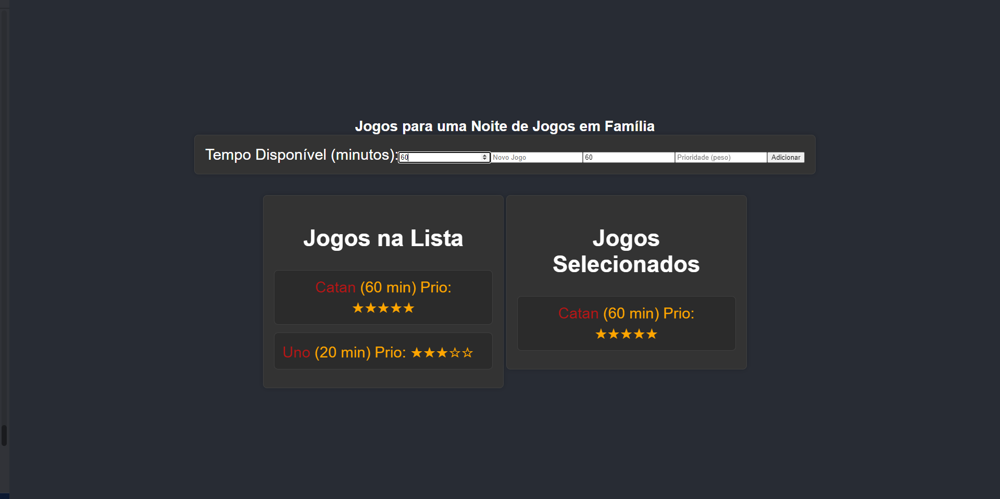

## Family-game-night

Temas:
 - Programação dinâmica


## Alunos
|Matrícula | Aluno |
| -- | -- |
| 17/0114139  |  Samuel Victor Castro Macêdo |
| 19/0036427  |  Pedro Henrique Caldeira de Moraes|

## Sobre 

Bem-vindo ao "Family-game-night", sua solução interativa para transformar uma simples noite em família em uma experiência única e memorável! Este projeto inovador combina a emoção de escolher jogos de tabuleiro com a eficácia do algoritmo da Mochila para criar uma noite perfeita de diversão para todos.

Porque acreditamos que cada noite em família merece ser única e cheia de alegria. Com "Family-game-night", não é apenas sobre jogar, mas criar memórias especiais que durarão por gerações. Prepare-se para uma noite mágica cheia de diversão, risos e conexão familiar!


## Screenshots





## Instalação

**Linguagem**: JavaScript (React)<br>
**Bundler/Package Manager**: npm<br>
## Instalação

**Linguagem**: JavaScript (React)<br>
**Bundler/Package Manager**: npm<br>

**Dependências**
 
 - Node.js
- npm (Node Package Manager)

**Execução**
- Clone o projeto (ou baixe):

Certifique-se de ter o Node.js instalado em seu sistema na versão 14 ou superior.

Abra um terminal na pasta do seu projeto.

Execute o seguinte comando para instalar as dependências do projeto:
bash
Copy code
npm install
**Execução**
- Clone o projeto (ou baixe):
  


``` shell
  git clone https://github.com/projeto-de-algoritmos/PD_Family-game-night/
  && cd PD_Family-game-night
  && cd Family-game-night
```   
 
 - Execute o comando
 ```  shell
npm start
```   
    
    
## Uso 
1. Adicionar Jogos Predefinidos:

Ao abrir a aplicação, você verá uma lista de jogos predefinidos, como Monopoly, Uno e Catan.
Esses jogos já possuem imagens e informações predefinidas.
Para adicionar um desses jogos à sua lista, basta clicar sobre o jogo desejado na seção "Jogos na Lista".

2. Adicionar Novos Jogos:

Utilize os campos de entrada fornecidos abaixo da seção "Jogos na Lista" para adicionar novos jogos.
Insira o nome do jogo, o tempo estimado para jogar (em minutos) e atribua uma prioridade de peso (opcional).
Clique no botão "Adicionar" para incluir o novo jogo na lista.

3. Ajustar Tempo Disponível:

No campo "Tempo Disponível (minutos)", você pode inserir a quantidade de tempo que você tem disponível para jogar.
Isso influenciará na seleção de jogos mais adequada para o tempo disponível.

4. Visualizar Jogos Selecionados:

Na seção "Jogos Selecionados", a aplicação automaticamente escolherá os jogos mais apropriados com base no tempo disponível e nas prioridades atribuídas.


## Apresentação
[Link Apresentação](https://youtu.be/Ku_zeBDexuU)
